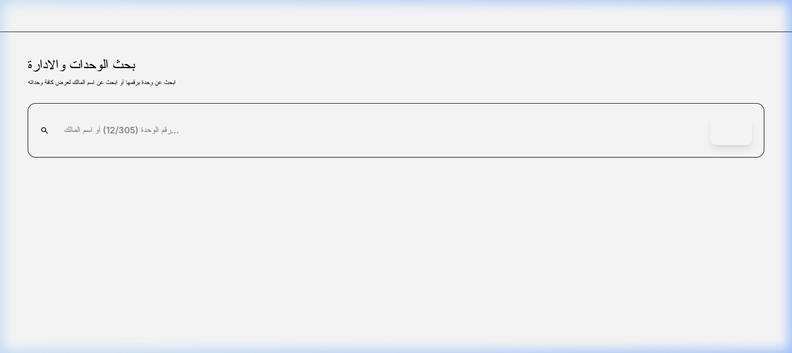
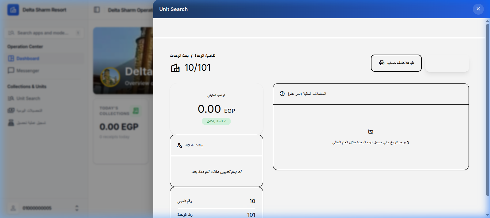
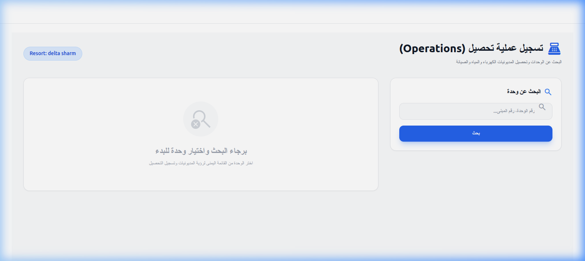
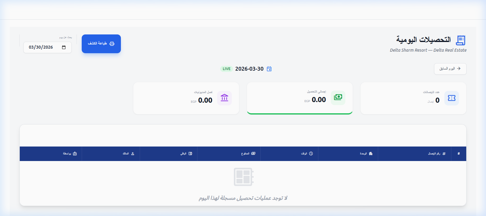

# OwnerConnect - Delta Sharm Resort Management

تطبيق متكامل لإدارة المنتجعات السياحية والعقارية، يهدف إلى ربط الملاك بإدارة المنتجع وتسهيل عمليات التحصيل والمتابعة المالية.

---

## 🚀 آخر التحديثات: تطوير واجهة الداتا انتري (Data Entry Dashboard)

تم تحديث واجهة الموظف (Data Entry) لتصبح أكثر كفاءة ووضوحاً، مع التركيز على سرعة الوصول للمعلومات المالية.

### 1. لوحة تحكم ذكية (Enhanced KPI Cards)
تم تكبير حجم كروت الأداء لتصبح بنمط "ID Card" مع تمييز الألوان لتنبيه الموظف فوراً:
- **الأخضر**: إجمالي التحصيلات اليومية.
- **الأحمر**: إجمالي المديونيات المتأخرة.

### 2. نظام بحث الوحدات المتطور (Advanced Unit Search)
إضافة محرك بحث يتيح للموظف العثور على أي وحدة من خلال:
- رقم الوحدة (Unit Number).
- اسم المالك (Owner Name) - يعرض كافة الوحدات التابعة للمالك مرة واحدة.

### 3. ملف تفصيلي لكل وحدة (Unit Analytics)
عند اختيار وحدة، يظهر ملف كامل يحتوي على:
- **الرصيد الحالي**: تنبيه فوري بحالة المديونية.
- **بيانات الملاك**: عرض تفصيلي لهوية المالك المسجل.
- **تاريخ المعاملات**: سجل مالي كامل لآخر 12 شهر (مطالبات وتحصيلات).

### 4. طباعة كشوف الحساب (Printable Statements)
إمكانية استخراج وكشف حساب مالي نظيف وجاهز للطباعة فوراً من داخل صفحة الوحدة.

### 5. دورة التحصيل (Collection Workflow)
النظام يسهل عملية تسجيل المقبوضات ومتابعة التقارير اليومية بدقة عالية.

| تسجيل التحصيل | التقارير اليومية |
| :--- | :--- |
|  |  |

---

## 🛠️ المميزات التقنية
- **Backend**: Django 5.1 & Django Rest Framework.
- **UI**: Tailwind CSS with Unfold Admin Theme.
- **Database**: PostgreSQL (Production) / SQLite (Dev).
- **Security**: Role-based access control (RBAC).

---

## 📞 الدعم الفني
للمساعدة أو الاستفسار، يرجى التواصل مع فريق تطوير OwnerConnect.
