# OwnerConnect

**A multi-resort platform that connects property owners and tenants with the management of their resort village — charges, payments, rentals, access passes and support in one mobile app, run from a staff web console.**

Django + DRF backend · Flutter mobile app · multi-tenant by design (every resort is isolated from every other) · 12 app languages with full RTL · 192 backend tests + 79 mobile tests

<p align="center">
  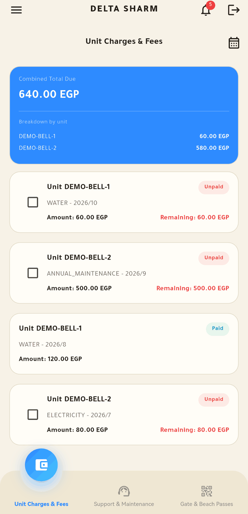
  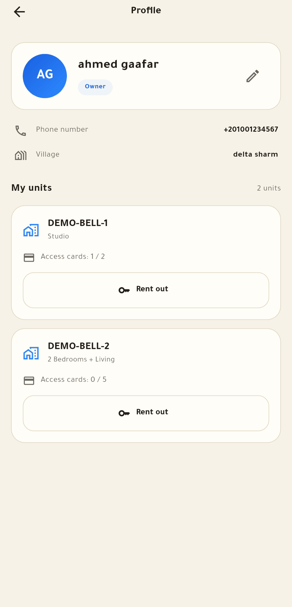
  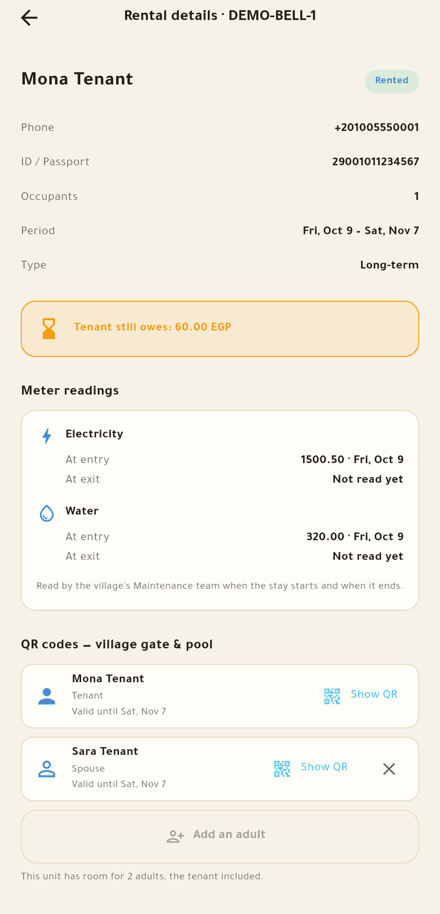
  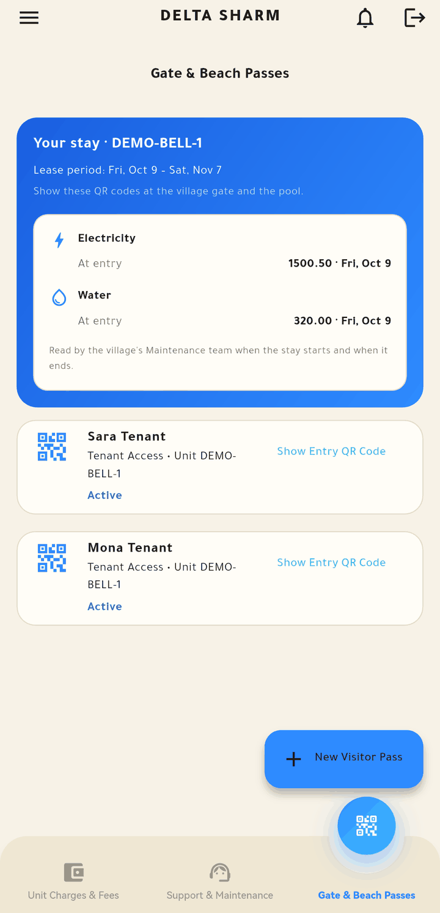
  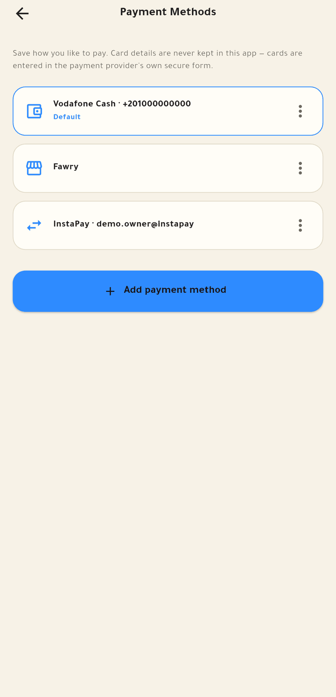
</p>

> The screenshots show a seeded development database (demo units, demo tenants). No real resident data appears anywhere in this repository.

---

## What it does

A resort village has hundreds of units owned by people who mostly live elsewhere. The management has to bill them for electricity, water and maintenance, collect the money, let guests and tenants through the gate and the pool, and answer maintenance requests. OwnerConnect puts both sides on one system:

- **Owners and tenants** use the mobile app — see what is due, pay, defer, ask for service, get QR passes, rent their unit out.
- **Resort staff** use a web console — import the monthly consumption sheet, review and publish charges, record cash payments, print statements, answer tickets and chat.
- **One backend serves many resorts.** A resort is a tenant; nothing one resort holds is reachable from another.

## The app

### Owner: charges, profile and units

| Sign in | Charges across all units | Navigation drawer | Profile with every unit |
| :---: | :---: | :---: | :---: |
| 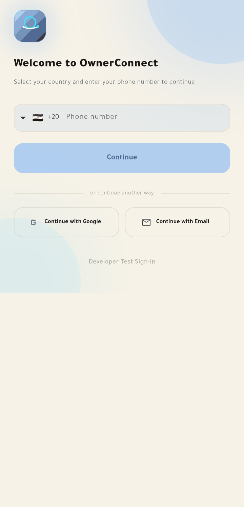 |  | 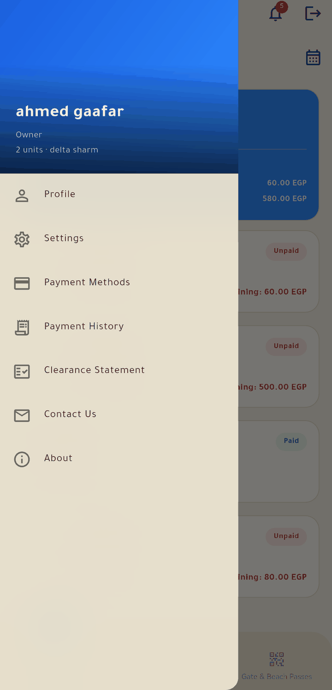 |  |

Phone, Google or e-mail sign-in through Firebase. The home screen shows one combined total with a per-unit breakdown, month filtering, and the choice to pay online, defer, or pay at the accounts office.

### Renting a unit out

| The rental form | Adding an adult | Adults and papers | Confirming the utility transfer |
| :---: | :---: | :---: | :---: |
| 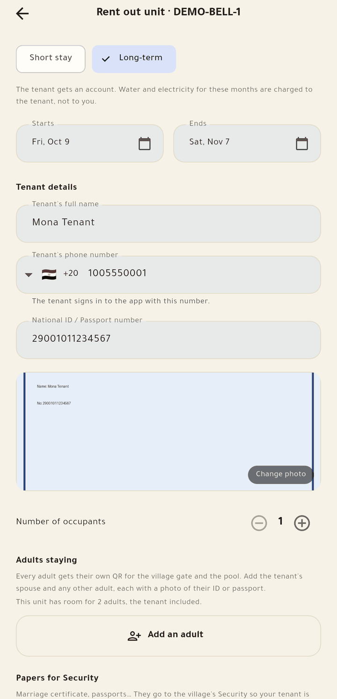 | 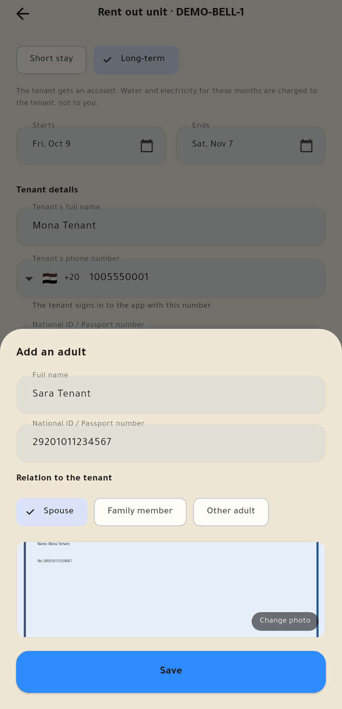 | 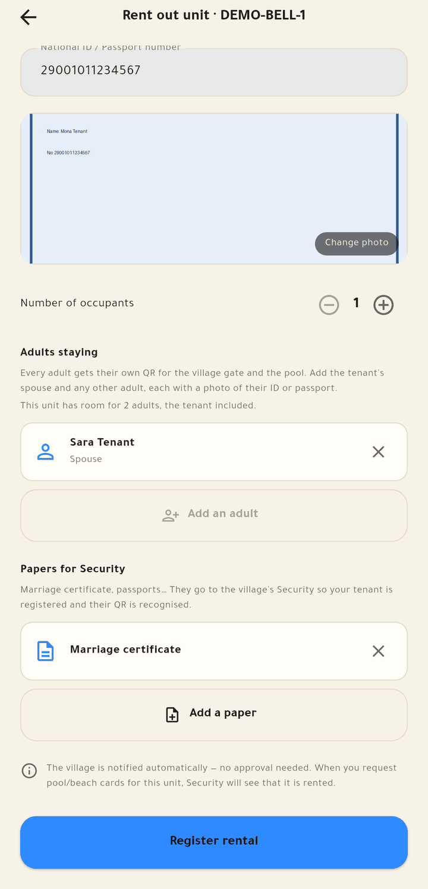 | 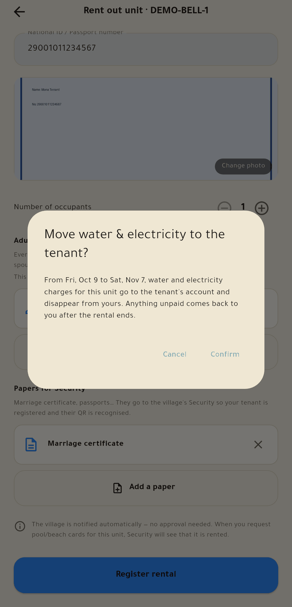 |

The owner picks short or long term and enters the tenant's name, phone, ID number and ID photo. On a long lease the app asks before moving water and electricity to the tenant; nothing is sent if the owner says no.

### Running the rental

| Profile after renting | Utilities moved to the tenant | Rental details | QR codes and papers |
| :---: | :---: | :---: | :---: |
| 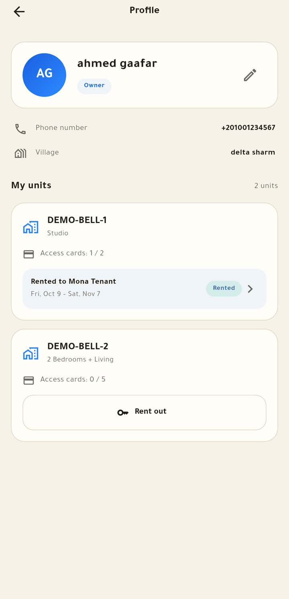 | 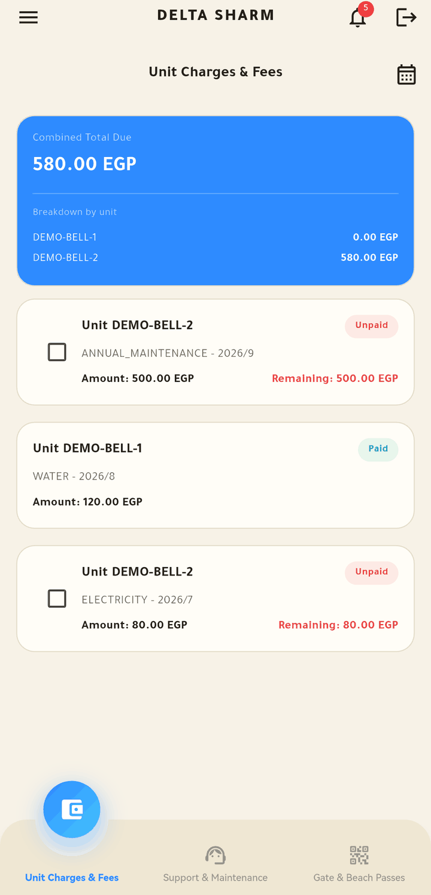 |  | 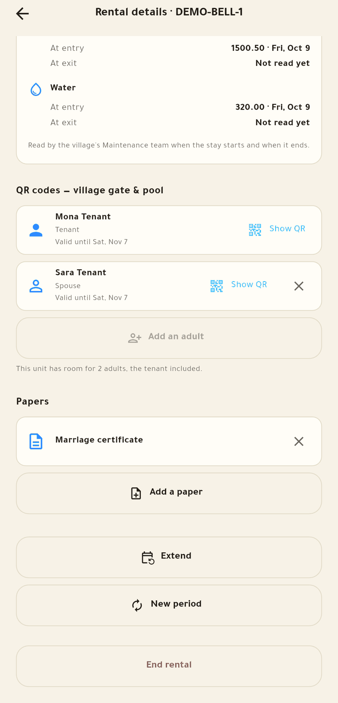 |

Once a long lease starts, the owner's total drops from 640 to 580 EGP — the tenant's water bill is no longer theirs. The owner can extend, renew from scratch, add or remove adults, and send papers (marriage certificate, passports) to Security.

### QR access, payment methods and the tenant's side

| A QR code | Saved payment methods | Adding one | What the tenant sees | The tenant's stay |
| :---: | :---: | :---: | :---: | :---: |
| 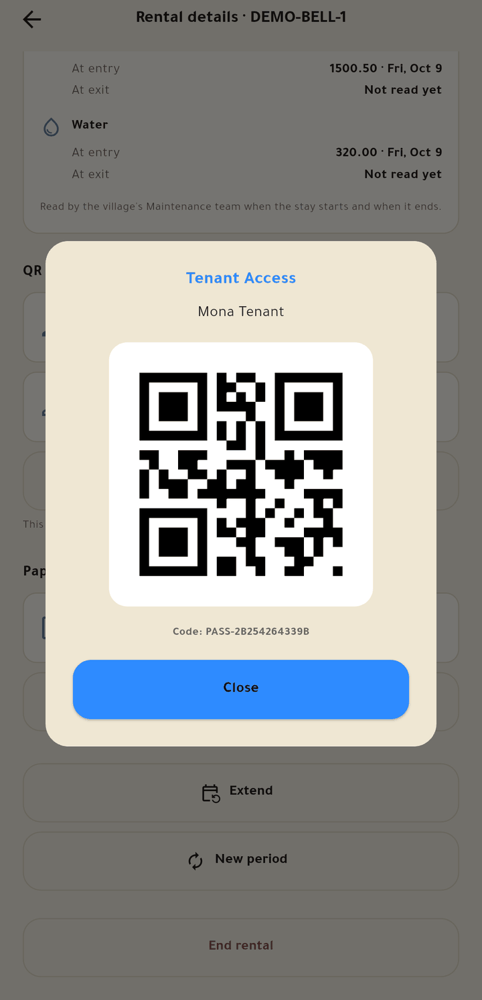 |  | 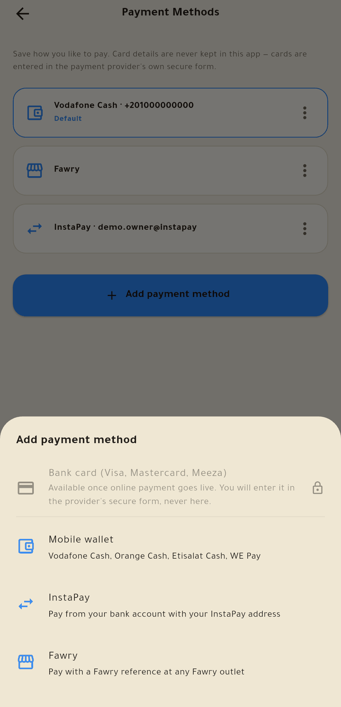 | 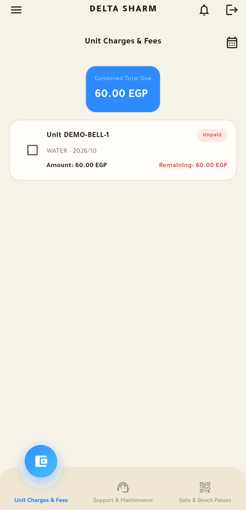 |  |

Every adult in the unit gets their own QR for the gate and the pool, and the code stays valid when the owner extends or renews the rental. The tenant sees only water and electricity, their stay dates, the entry meter readings Maintenance took, and their QR codes.

## The staff web console

Built on Django admin (Unfold theme) plus purpose-built screens for the data-entry and accounts desks.

| Operations dashboard | A unit's statement |
| :---: | :---: |
| 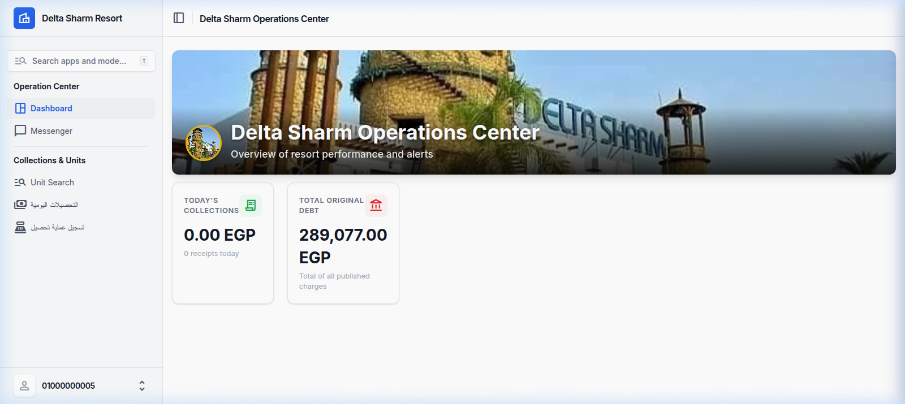 | 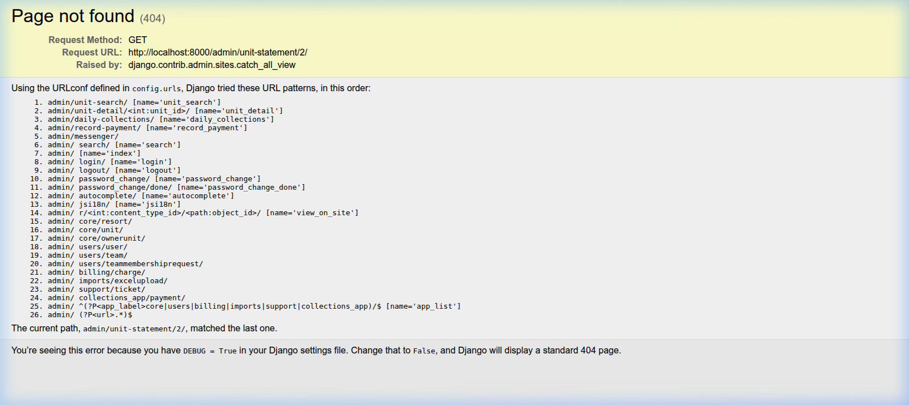 |

- Monthly **Excel import wizard** → charges land as *pending* → reviewed → **published** to owners with a push notification.
- Cashier screens: unit search (by number or owner), record a payment, daily collections, printable statements.
- Role-based access: Super Admin, Resort Admin, General Manager, Financial Manager, Supervisor, Data Entry, Reception, Maintenance Desk, Housekeeping Desk, Security, Recreation, Owner, Tenant.
- WebSocket **messenger** between staff and owners.

## Features

**Money**
- Combined multi-unit totals, month filter, payment history.
- Online payment through Paymob with a signed webhook; a combined payment produces **one receipt per unit**.
- Partial payment: choose which charges it covers and when the rest will be paid (auto-deferred, capped at 5 days).
- Self-service deferral (up to 3 days) and payment-plan requests that staff approve.
- Bilingual (English + Arabic on every line) PDF **receipts** and tenant **clearance statements**, generated once and stored.
- Saved payment methods: mobile wallet, InstaPay, Fawry. Card numbers are never stored — cards will be entered in the payment provider's own secure form.

**Rentals**
- Owner-registered short and long rentals; no approval step.
- Long lease: water and electricity move to the tenant by whole calendar months; unpaid amounts fall back to the owner when the lease ends.
- One QR per adult, limited by the unit's card allowance; QR codes survive extend and renew.
- Papers go to Security; Maintenance records entry and exit meter readings.
- Tenant clearance statement once everything is paid.

**Access and service**
- Visitor and pool passes with QR; the village's Security desk approves pass requests.
- Support tickets (maintenance, housekeeping, reception, accounts) with attachments and chat.
- Announcements feed, notification inbox, push notifications.

## Architecture

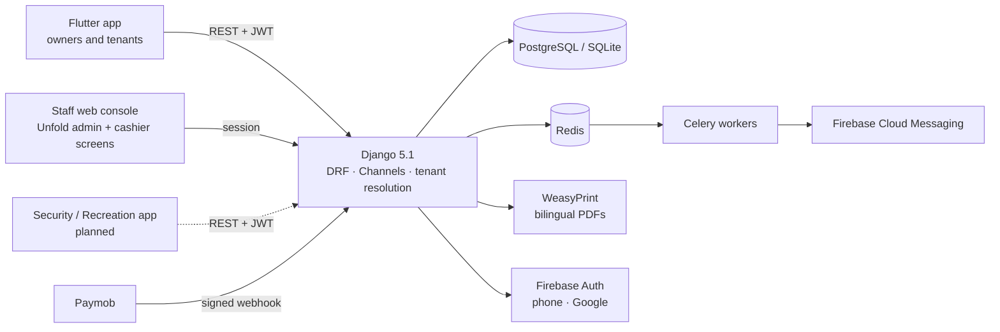

| Layer | Technology |
| :--- | :--- |
| Backend | Python 3.12, Django 5.1, Django REST Framework, SimpleJWT, drf-spectacular (OpenAPI at `/api/docs/`) |
| Real time and jobs | Django Channels + Daphne, Redis, Celery (push notifications run off the request path) |
| Documents | WeasyPrint with Noto Arabic fonts |
| Data | PostgreSQL in production, SQLite in development |
| Auth | Firebase (phone OTP, Google, e-mail) exchanged for the backend's own JWT |
| Mobile | Flutter 3, **pure BLoC**, Dio, GoRouter, qr_flutter, image_picker |
| Deployment | Docker Compose: web, Postgres, Redis, Celery worker and beat, nginx |

## Engineering notes

**Tenant isolation is enforced from the account, never from the client.** The resort is resolved from the authenticated user (`core/tenancy.py`); `TenantJWTAuthentication` re-resolves it once DRF has authenticated the request, and `scope_to_tenant` fails closed — no tenant means an empty queryset, never an unfiltered one. This exists because a review found that middleware alone sees every JWT request as anonymous and used to trust a client-supplied `X-Resort-ID` header. The regression tests use real bearer tokens (`core/testing.bearer_client`) because `force_authenticate` skips authentication classes and would hide exactly that bug.

**Private files stay private.** `/media/` is internal-only in nginx. Receipts, clearance PDFs, ticket attachments and tenants' ID photos are streamed through authenticated views that reuse the same ownership and resort scoping as the list endpoints. The mobile app downloads them with its own authenticated HTTP client instead of handing a URL to a browser.

**Money paths are server-authoritative.** The webhook trusts only the server-side `PaymentSession`, never client input; the session HMAC key is separate from `SECRET_KEY`. Receipts are rendered after the payment transaction commits, so a slow or failing PDF can never roll back a real payment.

**Rental rules live in one module.** `billing/lease_rules.py` decides which charges belong to the tenant (whole calendar months only) and what the owner can still see; `core/leases.py` owns registering, extending, renewing and ending a lease and keeps every adult's QR pass in sync. Both are covered by tests that freeze the clock at month edges.

**Mobile app.** Feature-first folders, pure BLoC with repository interfaces so every screen is tested against fakes, a separate translation table for newer strings with English fallback, and widget tests that run under the real app theme (a layout bug that only appears under it was caught that way).

A point-in-time security review is kept in [docs/SECURITY_AUDIT.md](docs/SECURITY_AUDIT.md), with a note on what has been fixed since.

## Quick start

### Backend

Needs Python 3.12 (Django 5.1.5 does not support 3.14).

```bash
python3.12 -m venv .venv && source .venv/bin/activate
pip install -r requirements.txt

cp .env.example .env            # set SECRET_KEY; ALLOW_DEV_AUTH_BYPASS=1 enables the dev sign-in
export CELERY_TASK_ALWAYS_EAGER=1   # run background tasks inline — Redis is then only needed for live chat
python manage.py migrate
python manage.py createsuperuser
python manage.py runserver 0.0.0.0:8000
```

Admin at <http://localhost:8000/admin/>, API docs at <http://localhost:8000/api/docs/>.
`setup_test_users.py` creates one account per staff role for local testing — **development only, it uses a fixed password**.

Real phone and Google sign-in need a Firebase project: put its service-account JSON outside the repo and point `FIREBASE_CREDENTIALS_FILE` at it. Without one, the mobile app's debug-only *Developer Test Sign-In* works against `ALLOW_DEV_AUTH_BYPASS=1`.

Everything in Docker: `docker compose up --build` (reads `.env`; set a real `SECRET_KEY`, database password and `DEBUG=False`).

### Mobile app

Needs Flutter 3.38+.

```bash
cd mobile_app
cp .env.example .env                                   # API_BASE_URL → your backend
cp lib/firebase_options.dart.example lib/firebase_options.dart   # or run `flutterfire configure`
flutter pub get
flutter run
```

On a real phone use the computer's LAN address in `API_BASE_URL` (not `127.0.0.1`) and allow port 8000 through the firewall. Android also needs your own `android/app/google-services.json`. Both Firebase files are git-ignored.

### Tests

```bash
python manage.py test           # 192 tests
cd mobile_app && flutter test   # 79 tests
```

## Status and known gaps

- **Card payments are not live.** The Paymob flow is built but there is no merchant account yet, so keys are intentionally empty and the app says card payment isn't available. Saved wallet / InstaPay / Fawry details are stored; cards will use Paymob's hosted form.
- **The Security / Recreation scanner app is not built.** The backend side exists (scan records, authenticated registry and file access); the app is planned as a separate Flutter project.
- Meter readings are recorded for reference; bills are not pro-rated by them.
- Six of the twelve app languages (Ukrainian, Finnish, Norwegian, Chinese, Hindi, Japanese) fall back to English for the newer rental and payment-method screens.
- No `Accountant` role yet — Financial Manager covers it.

---

## ملخص بالعربي

**OwnerConnect** منصة لإدارة القرى السياحية: تربط الملاك والمستأجرين بإدارة القرية في تطبيق موبايل واحد (المستحقات والدفع والتأجيل وطلبات الصيانة وتصاريح الدخول)، ولوحة ويب للموظفين لاستيراد فواتير الاستهلاك الشهرية ونشرها وتسجيل التحصيل وطباعة كشوف الحساب. النظام متعدد المنتجعات، وكل منتجع معزول تماماً عن غيره.

أحدث ما أُضيف: تأجير الوحدة (قصير أو طويل) مع تحويل الكهرباء والمياه للمستأجر عند الإيجار الطويل، وكيو آر كود لكل بالغ في الوحدة يظل صالحاً عند التمديد أو التجديد، وإرسال أوراق المستأجر لإدارة الأمن، وتسجيل قراءات العدادات بواسطة الصيانة، ومخالصة المستأجر، وصفحة طرق الدفع المحفوظة. بوابة الدفع بالبطاقات (Paymob) مبنية لكنها غير مفعّلة لحين فتح حساب تاجر.
